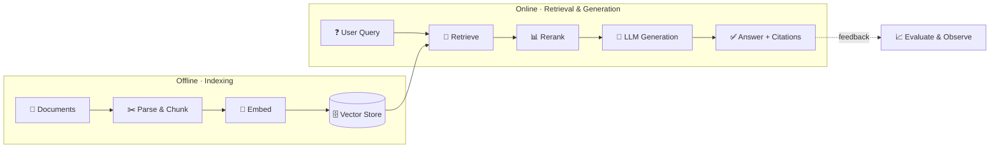

# 🧠 Awesome RAG — The Retrieval-Augmented Generation Knowledge Hub

**A curated, up-to-date map of the entire RAG ecosystem** — frameworks, vector databases, embedding models, retrieval & reranking, parsing, evaluation, datasets, papers, and learning resources.

<em>If this saves you time, please <a href="https://github.com/aiknowledgehub/rag">⭐ star the repo</a> — it helps more builders find it.</em>

---

## What is RAG?

**Retrieval-Augmented Generation (RAG)** connects a large language model to an external knowledge source. Instead of relying only on what a model memorized during training, a RAG system **retrieves** the most relevant documents at query time and **feeds them into the prompt** so the model can ground its answer in real, current, verifiable information.

This dramatically reduces hallucinations, lets you use private or domain-specific data, keeps answers up to date without retraining, and provides citations you can trace.

> **New to RAG?** Jump to the [🚀 Learning Path](#-learning-path) for a beginner-to-advanced route.

---

## 📚 Table of Contents

- [The RAG Pipeline](#the-rag-pipeline)
- [🧩 RAG Techniques](#-rag-techniques)
- [🛠️ Frameworks & Orchestration](#️-frameworks--orchestration)
- [📦 End-to-End & Open-Source RAG Apps](#-end-to-end--open-source-rag-apps)
- [🗄️ Vector Databases](#️-vector-databases)
- [⚡ ANN / Vector Search Libraries](#-ann--vector-search-libraries)
- [🔢 Embedding Models & Providers](#-embedding-models--providers)
- [🔎 Retrieval & Reranking](#-retrieval--reranking)
- [📄 Document Parsing & Chunking](#-document-parsing--chunking)
- [📊 Evaluation & Observability](#-evaluation--observability)
- [🧪 Datasets & Benchmarks](#-datasets--benchmarks)
- [🚀 Learning Path](#-learning-path)
- [📖 Tutorials, Courses & Cookbooks](#-tutorials-courses--cookbooks)
- [🎥 Videos & Talks](#-videos--talks)
- [📑 Research Papers](#-research-papers)
- [🤝 Contributing](#-contributing)
- [⭐ Star History](#-star-history)
- [📬 Contact](#-contact)
- [License](#license)

---

## The RAG Pipeline

Most RAG systems are a variation of the same flow: prepare your data once (offline), then retrieve and generate per query (online).

| Stage | What happens | Tooling in this list |
|-------|--------------|----------------------|
| **Parse** | Turn PDFs, HTML, docs into clean text | [Parsing & Chunking](#-document-parsing--chunking) |
| **Chunk** | Split text into retrievable units | [Parsing & Chunking](#-document-parsing--chunking) |
| **Embed** | Convert chunks to vectors | [Embedding Models](#-embedding-models--providers) |
| **Store** | Index vectors for fast search | [Vector Databases](#️-vector-databases) |
| **Retrieve** | Find candidates for a query (dense + keyword) | [Retrieval & Reranking](#-retrieval--reranking) |
| **Rerank** | Reorder candidates by true relevance | [Retrieval & Reranking](#-retrieval--reranking) |
| **Generate** | LLM answers grounded in retrieved context | [Frameworks](#️-frameworks--orchestration) |
| **Evaluate** | Measure faithfulness, relevance, latency | [Evaluation & Observability](#-evaluation--observability) |

---

## 🧩 RAG Techniques

A quick reference to the patterns you'll see referenced across the ecosystem.

| Technique | Idea | Reference |
|-----------|------|-----------|
| **Naive RAG** | Retrieve top-k by vector similarity, stuff into the prompt | [Survey](https://arxiv.org/abs/2312.10997) |
| **Hybrid Search** | Combine dense (semantic) + sparse (BM25/keyword) retrieval | [BM25S](https://github.com/xhluca/bm25s) |
| **Reranking** | Use a cross-encoder to reorder retrieved chunks | [Rerankers](#-retrieval--reranking) |
| **Query Transformation** | Rewrite / expand / decompose the query before retrieval | [RAG-Fusion](https://github.com/Raudaschl/rag-fusion) |
| **HyDE** | Generate a hypothetical answer, embed *that* to retrieve | [Paper](https://arxiv.org/abs/2212.10496) |
| **RAPTOR** | Recursively cluster & summarize into a retrieval tree | [Paper](https://arxiv.org/abs/2401.18059) |
| **Self-RAG** | Model decides when to retrieve and critiques its own output | [Paper](https://arxiv.org/abs/2310.11511) |
| **Corrective RAG (CRAG)** | Grade retrieved docs, fall back to web search if weak | [Paper](https://arxiv.org/abs/2401.15884) |
| **GraphRAG** | Build a knowledge graph for multi-hop & global questions | [Paper](https://arxiv.org/abs/2404.16130) · [Code](https://github.com/microsoft/graphrag) |
| **Agentic RAG** | An agent plans, routes, and iterates over multiple tools/sources | [GenAI Agents](https://github.com/NirDiamant/GenAI_Agents) |
| **Contextual Retrieval** | Prepend chunk-level context before embedding to cut failures | [Anthropic](https://www.anthropic.com/news/contextual-retrieval) |
| **Late Chunking** | Embed the full document, then pool per-chunk for better context | [Paper](https://arxiv.org/abs/2409.04701) |

> 💡 **The best hands-on resource** for these is [NirDiamant/RAG_Techniques](https://github.com/NirDiamant/RAG_Techniques) — runnable notebooks for ~30 techniques.

---

## 🛠️ Frameworks & Orchestration

Libraries for composing retrieval + generation pipelines in code.

| Name | Description | Links |
|------|-------------|-------|
| **LangChain** | The most popular framework for building LLM & RAG apps | [Site](https://www.langchain.com) · [GitHub](https://github.com/langchain-ai/langchain) |
| **LangGraph** | Build stateful, multi-step & agentic RAG as graphs | [Site](https://www.langchain.com/langgraph) · [GitHub](https://github.com/langchain-ai/langgraph) |
| **LlamaIndex** | Data framework purpose-built for RAG over your data | [Site](https://www.llamaindex.ai) · [GitHub](https://github.com/run-llama/llama_index) |
| **Haystack** | Production-ready, composable RAG & search pipelines | [Site](https://haystack.deepset.ai) · [GitHub](https://github.com/deepset-ai/haystack) |
| **DSPy** | Program — not prompt — LLM pipelines; optimize them automatically | [GitHub](https://github.com/stanfordnlp/dspy) |
| **txtai** | All-in-one embeddings database for semantic search & RAG | [GitHub](https://github.com/neuml/txtai) |
| **R2R** | "RAG to Riches" — a full RAG engine with ingestion & retrieval API | [GitHub](https://github.com/SciPhi-AI/R2R) |
| **Semantic Kernel** | Microsoft's SDK to integrate LLMs into apps (C#/Python/Java) | [GitHub](https://github.com/microsoft/semantic-kernel) |
| **llmware** | Enterprise RAG toolkit optimized for small, specialized models | [GitHub](https://github.com/llmware-ai/llmware) |
| **GraphRAG** | Microsoft's graph-based RAG over private datasets | [GitHub](https://github.com/microsoft/graphrag) |
| **fastRAG** | Intel Labs research framework for efficient RAG | [GitHub](https://github.com/IntelLabs/fastRAG) |
| **Cognita** | Modular, UI-driven framework to take RAG from prototype to prod | [GitHub](https://github.com/truefoundry/cognita) |

---

## 📦 End-to-End & Open-Source RAG Apps

Ready-to-run applications — point them at your documents and chat.

| Name | Description | Links |
|------|-------------|-------|
| **Dify** | Visual, open-source LLM app platform with built-in RAG | [GitHub](https://github.com/langgenius/dify) |
| **RAGFlow** | Deep-document-understanding RAG engine with grounded citations | [GitHub](https://github.com/infiniflow/ragflow) |
| **AnythingLLM** | All-in-one desktop & docker RAG app for any LLM/vector DB | [GitHub](https://github.com/Mintplex-Labs/anything-llm) |
| **Onyx** (ex-Danswer) | Open-source AI assistant that connects to your company's docs | [GitHub](https://github.com/onyx-dot-app/onyx) |
| **Open WebUI** | Self-hosted ChatGPT-style UI with RAG & document upload | [GitHub](https://github.com/open-webui/open-webui) |
| **Quivr** | Opinionated RAG framework / "second brain" for your files | [GitHub](https://github.com/QuivrHQ/quivr) |
| **Kotaemon** | Clean, customizable open-source RAG UI for chatting with docs | [GitHub](https://github.com/Cinnamon/kotaemon) |
| **Verba** | Weaviate's "Golden RAGtriever" — RAG out of the box | [GitHub](https://github.com/weaviate/Verba) |
| **PrivateGPT** | Ask questions about your documents fully offline | [GitHub](https://github.com/zylon-ai/private-gpt) |
| **Khoj** | Self-hostable AI second brain across your notes & docs | [GitHub](https://github.com/khoj-ai/khoj) |
| **Flowise** | Drag-and-drop builder for LLM & RAG flows | [GitHub](https://github.com/FlowiseAI/Flowise) |
| **Langflow** | Low-code visual builder for RAG and agent workflows | [GitHub](https://github.com/langflow-ai/langflow) |

---

## 🗄️ Vector Databases

Stores that index embeddings for fast similarity search. (OSS = open source)

| Name | Notes | OSS | Links |
|------|-------|:---:|-------|
| **Qdrant** | Rust-based, fast, rich filtering; great DX | ✅ | [Site](https://qdrant.tech) · [GitHub](https://github.com/qdrant/qdrant) |
| **Weaviate** | Vector DB with hybrid search & built-in modules | ✅ | [Site](https://weaviate.io) · [GitHub](https://github.com/weaviate/weaviate) |
| **Milvus** | Highly scalable vector DB for billion-scale workloads | ✅ | [Site](https://milvus.io) · [GitHub](https://github.com/milvus-io/milvus) |
| **Chroma** | Lightweight, developer-friendly embedding database | ✅ | [Site](https://www.trychroma.com) · [GitHub](https://github.com/chroma-core/chroma) |
| **pgvector** | Vector similarity search inside PostgreSQL | ✅ | [GitHub](https://github.com/pgvector/pgvector) |
| **LanceDB** | Serverless, embedded vector DB on the Lance columnar format | ✅ | [Site](https://lancedb.com) · [GitHub](https://github.com/lancedb/lancedb) |
| **Vespa** | Battle-tested engine for search, recommendation & RAG at scale | ✅ | [Site](https://vespa.ai) · [GitHub](https://github.com/vespa-engine/vespa) |
| **Marqo** | End-to-end vector search with embedding generation built in | ✅ | [GitHub](https://github.com/marqo-ai/marqo) |
| **Redis** | In-memory vector search via RediSearch | ✅ | [GitHub](https://github.com/RediSearch/RediSearch) |
| **Elasticsearch** | Mature search engine with dense-vector (kNN) support | ✅ | [GitHub](https://github.com/elastic/elasticsearch) |
| **Pinecone** | Fully managed, serverless vector database | — | [Site](https://www.pinecone.io) |

---

## ⚡ ANN / Vector Search Libraries

Embeddable approximate-nearest-neighbor libraries when you don't need a full database.

| Name | Description | Links |
|------|-------------|-------|
| **FAISS** | Facebook AI's library for efficient similarity search | [GitHub](https://github.com/facebookresearch/faiss) |
| **hnswlib** | Fast header-only HNSW implementation | [GitHub](https://github.com/nmslib/hnswlib) |
| **Annoy** | Spotify's memory-mapped ANN library | [GitHub](https://github.com/spotify/annoy) |
| **ScaNN** | Google Research's scalable nearest-neighbor search | [GitHub](https://github.com/google-research/google-research/tree/master/scann) |
| **USearch** | Compact, multi-modal, single-file vector search engine | [GitHub](https://github.com/unum-cloud/usearch) |

---

## 🔢 Embedding Models & Providers

Models that turn text (and images) into vectors. Check the leaderboard before committing.

| Name | Description | Links |
|------|-------------|-------|
| **MTEB Leaderboard** | The benchmark for picking an embedding model — start here | [Leaderboard](https://huggingface.co/spaces/mteb/leaderboard) |
| **Sentence-Transformers** | The standard library for open embedding & reranker models | [GitHub](https://github.com/UKPLab/sentence-transformers) |
| **BGE / FlagEmbedding** | BAAI's strong open embedding & reranker family | [GitHub](https://github.com/FlagOpen/FlagEmbedding) |
| **Nomic Embed** | Fully open, reproducible long-context embeddings | [Model](https://huggingface.co/nomic-ai/nomic-embed-text-v1.5) |
| **OpenAI Embeddings** | `text-embedding-3` small/large — strong managed default | [Docs](https://platform.openai.com/docs/guides/embeddings) |
| **Cohere Embed** | Multilingual managed embeddings with compression | [Site](https://cohere.com/embed) |
| **Voyage AI** | High-quality managed embeddings (incl. code & legal/finance) | [Site](https://www.voyageai.com) |
| **Jina Embeddings** | Open long-context & multilingual embedding models | [Site](https://jina.ai/embeddings) |
| **Model2Vec** | Distill embeddings into tiny, blazing-fast static models | [GitHub](https://github.com/MinishLab/model2vec) |

---

## 🔎 Retrieval & Reranking

Improve *which* documents reach the LLM — usually the highest-ROI upgrade to a RAG system.

| Name | Type | Links |
|------|------|-------|
| **rerankers** | Unified Python API across reranking methods | [GitHub](https://github.com/AnswerDotAI/rerankers) |
| **Cohere Rerank** | Managed cross-encoder reranking endpoint | [Site](https://cohere.com/rerank) |
| **ColBERT** | Late-interaction retrieval for high accuracy | [GitHub](https://github.com/stanford-futuredata/ColBERT) |
| **RAGatouille** | Make ColBERT-style retrieval easy to train & use | [GitHub](https://github.com/AnswerDotAI/RAGatouille) |
| **ColPali** | Vision late-interaction retrieval directly over document images | [GitHub](https://github.com/illuin-tech/colpali) |
| **FlashRank** | Ultra-light, fast reranking with tiny cross-encoders | [GitHub](https://github.com/PrithivirajDamodaran/FlashRank) |
| **rank_bm25** | Classic BM25 sparse retrieval in pure Python | [GitHub](https://github.com/dorianbrown/rank_bm25) |
| **BM25S** | Fast BM25 (Scipy-based), 100× quicker than rank_bm25 | [GitHub](https://github.com/xhluca/bm25s) |
| **SPLADE** | Learned sparse retrieval (the best of dense + keyword) | [GitHub](https://github.com/naver/splade) |

---

## 📄 Document Parsing & Chunking

Garbage in, garbage out — clean extraction and smart chunking matter more than any model choice.

| Name | Description | Links |
|------|-------------|-------|
| **Unstructured** | Preprocess PDFs, HTML, Office docs into clean, chunkable text | [GitHub](https://github.com/Unstructured-IO/unstructured) |
| **Docling** | IBM's high-fidelity document parser (tables, layout, structure) | [GitHub](https://github.com/docling-project/docling) |
| **LlamaParse** | LlamaIndex's GenAI-native parser for complex PDFs | [Site](https://www.llamaindex.ai/llamaparse) |
| **Marker** | Fast, accurate PDF → Markdown/JSON conversion | [GitHub](https://github.com/datalab-to/marker) |
| **MinerU** | High-quality PDF/document extraction toolkit | [GitHub](https://github.com/opendatalab/MinerU) |
| **Firecrawl** | Turn any website into clean, LLM-ready markdown | [GitHub](https://github.com/mendableai/firecrawl) |
| **Crawl4AI** | Open-source LLM-friendly web crawler & scraper | [GitHub](https://github.com/unclecode/crawl4ai) |
| **Chonkie** | A no-nonsense, lightweight chunking library for RAG | [GitHub](https://github.com/chonkie-inc/chonkie) |
| **semantic-chunkers** | Split text on meaning rather than fixed sizes | [GitHub](https://github.com/aurelio-labs/semantic-chunkers) |

---

## 📊 Evaluation & Observability

You can't improve a RAG system you can't measure. Track faithfulness, context relevance, and latency.

| Name | Description | Links |
|------|-------------|-------|
| **RAGAS** | The reference framework for evaluating RAG pipelines | [GitHub](https://github.com/explodinggradients/ragas) |
| **DeepEval** | "Pytest for LLMs" — unit-test RAG outputs in CI | [GitHub](https://github.com/confident-ai/deepeval) |
| **TruLens** | Evaluate & trace LLM apps with the "RAG triad" of metrics | [GitHub](https://github.com/truera/trulens) |
| **Arize Phoenix** | Open-source LLM tracing, evaluation & observability | [GitHub](https://github.com/Arize-ai/phoenix) |
| **Langfuse** | Open-source LLM engineering platform: tracing, evals, prompts | [GitHub](https://github.com/langfuse/langfuse) |
| **Giskard** | Test suite to find RAG quality, bias & security issues | [GitHub](https://github.com/Giskard-AI/giskard) |
| **promptfoo** | Test, compare & red-team prompts and RAG configs | [GitHub](https://github.com/promptfoo/promptfoo) |
| **continuous-eval** | Modular, code-level evaluation for RAG/LLM pipelines | [GitHub](https://github.com/relari-ai/continuous-eval) |
| **RAGChecker** | Fine-grained diagnostic metrics for RAG (Amazon Science) | [GitHub](https://github.com/amazon-science/RAGChecker) |

---

## 🧪 Datasets & Benchmarks

For training retrievers and benchmarking RAG quality.

| Name | Description | Links |
|------|-------------|-------|
| **BEIR** | Heterogeneous benchmark for zero-shot retrieval | [GitHub](https://github.com/beir-cellar/beir) |
| **MTEB** | Massive Text Embedding Benchmark (the standard for embeddings) | [GitHub](https://github.com/embeddings-benchmark/mteb) |
| **Natural Questions** | Real Google-search questions with long & short answers | [Site](https://ai.google.com/research/NaturalQuestions) |
| **HotpotQA** | Multi-hop QA requiring reasoning over multiple docs | [Site](https://hotpotqa.github.io/) |
| **MS MARCO** | Large-scale passage ranking & QA from Bing queries | [Site](https://microsoft.github.io/msmarco/) |
| **TriviaQA** | Large QA dataset with evidence documents | [Site](https://nlp.cs.washington.edu/triviaqa/) |
| **SQuAD** | The classic reading-comprehension benchmark | [Site](https://rajpurkar.github.io/SQuAD-explorer/) |
| **KILT** | Unified benchmark for knowledge-intensive tasks | [GitHub](https://github.com/facebookresearch/KILT) |
| **RAGBench** | 100k-example explainable RAG benchmark | [Dataset](https://huggingface.co/datasets/rungalileo/ragbench) |
| **FRAMES** | Google's factuality + retrieval + reasoning benchmark | [Dataset](https://huggingface.co/datasets/google/frames-benchmark) |

---

## 🚀 Learning Path

A pragmatic route from zero to production.

1. **Understand the idea** → read [What is RAG?](#what-is-rag) above and the [RAG Survey](https://arxiv.org/abs/2312.10997).
2. **Build your first pipeline** → follow [LangChain RAG from Scratch](https://github.com/langchain-ai/rag-from-scratch) or the [LlamaIndex starter](https://docs.llamaindex.ai/en/stable/getting_started/starter_example/).
3. **Learn the vocabulary of the stack** → skim the [RAG Pipeline](#the-rag-pipeline) table and pick one tool per stage.
4. **Level up retrieval quality** → work through [NirDiamant/RAG_Techniques](https://github.com/NirDiamant/RAG_Techniques) (hybrid search, reranking, query transforms).
5. **Measure everything** → add [RAGAS](https://github.com/explodinggradients/ragas) or [DeepEval](https://github.com/confident-ai/deepeval) before you tune.
6. **Go advanced** → explore [GraphRAG](https://github.com/microsoft/graphrag), [Agentic RAG](https://github.com/NirDiamant/GenAI_Agents), and [Contextual Retrieval](https://www.anthropic.com/news/contextual-retrieval).

---

## 📖 Tutorials, Courses & Cookbooks

| Title | Description | Link |
|-------|-------------|------|
| **RAG Techniques** | ~30 runnable notebooks, beginner → advanced (highly recommended) | [GitHub](https://github.com/NirDiamant/RAG_Techniques) |
| **LangChain: RAG from Scratch** | Video + code series building RAG concept by concept | [GitHub](https://github.com/langchain-ai/rag-from-scratch) |
| **DeepLearning.AI: Advanced RAG** | Short course on building & evaluating advanced RAG | [Course](https://www.deeplearning.ai/short-courses/building-evaluating-advanced-rag/) |
| **Hugging Face Cookbook** | Practical, runnable RAG & LLM recipes | [Cookbook](https://huggingface.co/learn/cookbook) |
| **Pinecone Learning Center** | Clear write-ups on retrieval, embeddings & vector search | [Guide](https://www.pinecone.io/learn/) |
| **Weaviate Academy** | Free courses on vector search and RAG | [Academy](https://weaviate.io/developers/academy) |
| **Anthropic Cookbook** | Recipes incl. contextual retrieval & RAG patterns | [GitHub](https://github.com/anthropics/anthropic-cookbook) |
| **MS: Generative AI for Beginners** | 21-lesson course covering RAG, embeddings & search | [GitHub](https://github.com/microsoft/generative-ai-for-beginners) |

---

## 🎥 Videos & Talks

| Title | Presenter | Link |
|-------|-----------|------|
| **Building Production-Ready RAG Applications** | Jerry Liu (LlamaIndex) | [YouTube](https://www.youtube.com/watch?v=TRjq7t2Ms5I) |
| **RAG From Scratch** (playlist) | LangChain | [YouTube](https://www.youtube.com/playlist?list=PLfaIDFEXuae2LXbO1_PKyVJiQ23ZztA0x) |
| **Building Long Context RAG** | Lance Martin (LangChain) | [YouTube](https://www.youtube.com/watch?v=SsHUNfhF32s) |

---

## 📑 Research Papers

Foundational and influential work. Years and authors verified.

| Title | Authors | Year | Link |
|-------|---------|:----:|------|
| **RAG: Retrieval-Augmented Generation for Knowledge-Intensive NLP Tasks** | Lewis et al. | 2020 | [arXiv](https://arxiv.org/abs/2005.11401) |
| **REALM: Retrieval-Augmented Language Model Pre-Training** | Guu et al. | 2020 | [arXiv](https://arxiv.org/abs/2002.08909) |
| **DPR: Dense Passage Retrieval for Open-Domain QA** | Karpukhin et al. | 2020 | [arXiv](https://arxiv.org/abs/2004.04906) |
| **ColBERT: Efficient & Effective Passage Search via Late Interaction** | Khattab & Zaharia | 2020 | [arXiv](https://arxiv.org/abs/2004.12832) |
| **FiD: Leveraging Passage Retrieval with Generative Models** | Izacard & Grave | 2020 | [arXiv](https://arxiv.org/abs/2007.01282) |
| **RETRO: Improving LMs by Retrieving from Trillions of Tokens** | Borgeaud et al. | 2021 | [arXiv](https://arxiv.org/abs/2112.04426) |
| **Atlas: Few-shot Learning with Retrieval-Augmented LMs** | Izacard et al. | 2022 | [arXiv](https://arxiv.org/abs/2208.03299) |
| **HyDE: Precise Zero-Shot Dense Retrieval w/o Relevance Labels** | Gao et al. | 2022 | [arXiv](https://arxiv.org/abs/2212.10496) |
| **Lost in the Middle: How LMs Use Long Contexts** | Liu et al. | 2023 | [arXiv](https://arxiv.org/abs/2307.03172) |
| **Self-RAG: Self-Reflective Retrieval-Augmented Generation** | Asai et al. | 2023 | [arXiv](https://arxiv.org/abs/2310.11511) |
| **RAPTOR: Recursive Abstractive Processing for Tree-Org. Retrieval** | Sarthi et al. | 2024 | [arXiv](https://arxiv.org/abs/2401.18059) |
| **Corrective RAG (CRAG)** | Yan et al. | 2024 | [arXiv](https://arxiv.org/abs/2401.15884) |
| **GraphRAG: From Local to Global Query-Focused Summarization** | Edge et al. | 2024 | [arXiv](https://arxiv.org/abs/2404.16130) |
| **Seven Failure Points When Engineering a RAG System** | Barnett et al. | 2024 | [arXiv](https://arxiv.org/abs/2401.05856) |
| **RAG for LLMs: A Survey** | Gao et al. | 2023 | [arXiv](https://arxiv.org/abs/2312.10997) |

---

## 🤝 Contributing

This list is **community-driven** and contributions make it better. Found a great tool, fixed a broken link, or want to add a technique?

- 📌 Read the [Contribution Guidelines](CONTRIBUTING.md) for the format and quality bar.
- ➕ Open a Pull Request adding your resource to the right section (keep descriptions to one line).
- 🐛 Spotted a broken link or outdated entry? [Open an issue](https://github.com/aiknowledgehub/rag/issues).

Every contributor is credited. Be kind, be useful. 💛

---

## ⭐ Star History

If this hub helped you, a star keeps it discoverable for the next person.

---

## 📬 Contact

- **GitHub Issues** — [open an issue](https://github.com/aiknowledgehub/rag/issues) for questions, ideas, or corrections.
- **Email** — [codewithrashid@gmail.com](mailto:codewithrashid@gmail.com)

---

## License

Released under the **MIT License** — see [LICENSE](LICENSE). Resource links and trademarks belong to their respective owners.

**Let's build and advance the field of Retrieval-Augmented Generation together.** 🚀

Maintained by <a href="https://github.com/aiknowledgehub">AI Knowledge Hub</a> · Contributions welcome

